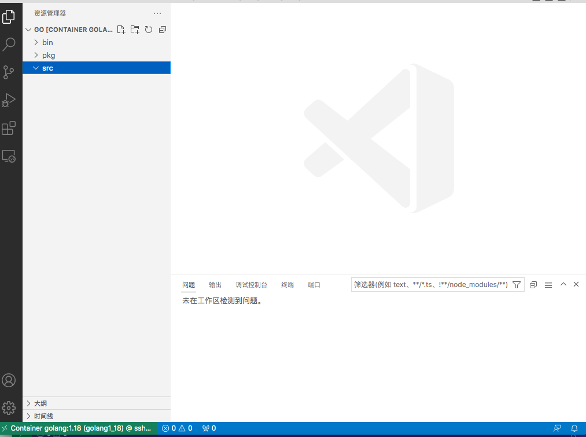
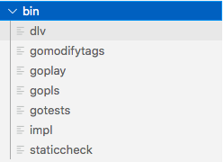
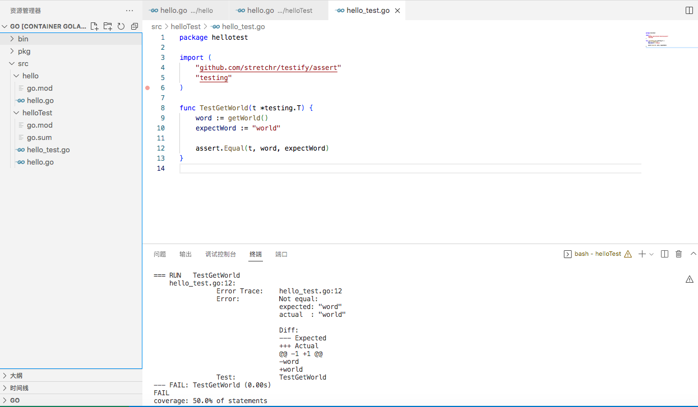

通常，我们在本地搭建IDE是费时费事的，动辄需要几个小时。部署完成之后也会占据大量系统资源。如今，我们通过CI/CD和容器技术自动部署应用程序；当然也可以利用容器技术来部署开发环境。基本思想就是**编辑工具作为前端，前端尽可能的瘦**；**编译相关工具作为后端以容器的方式部署在远端服务器或者是云上**。


### 快速搭建远端编译容器

以下我在实验室局域网内搭建编译环境用的方法，编程语言包含并不限于Go。

以我的笔记本作为“终端设备”，VS Code作为客户端程序，通过ssh协议访问远端的用于编译/运行的服务器；服务器这面不同版本的编译器是以容器的方式运行，这样既能保证服务器这面的环境是“干净的”，也能便于我们能够更清楚地看到编程语言不同标准版本间差异，这一点在学习C++了解语言标准间差异的时候用得比较多，在宿主机下安装多个C++编译器版本切换很麻烦，且容易出错。数据和程序以数据卷挂在的方式实现容器和宿主机之间的数据共享。


#### 服务器端配置

这里我用腾讯云服务器模拟局域网内负责编译的服务器，安装的系统是Ubuntu Server 20.04 LTS 64bit。购买好云服务器之后，需要设置并保存好管理员的密码。

点击<u>远程登录</u>的<u>一键登录</u>，会在网页上登录lighthouse的登录shell，为方便起见切换成root。

```shell
sudo su
```


##### 安装Docker环境

```shell
# 以下在root权限下操作

# 安装docker
curl -fsSL https://get.docker.com/ | sh
# 查看docker版本，检查是否安装成功
docker version

# 安装docker-compose。这里需要预先去docker-compose网站上查看一下版本信息
curl -L https://get.daocloud.io/docker/compose/releases/download/${docker_compose_version}/docker-compose-`uname -s`-`uname -m` > /usr/local/bin/docker-compose
# 给docker-compose程序添加可执行权限
chmod +x /usr/local/bin/docker-compose
# 检查docker-compose版本是否于指定版本一致
docker-compose version
```


##### 新用户配置

###### 创建用户

```shell
# 创建一个新用户，并新建这个用户的用户主目录
useradd -m ${your_user_name}
# 设置用户密码
passwd ${your_user_name}
```


###### 增加用户sudo权限

```shell
# 默认/etc/sudoers是不具有写权限的
chmod u+w /etc/sudoers
vi /etc/sudoers
```

在/etc/sudoers最后一行加入：

```shell
${your_user_name} ALL=(ALL:ALL) NOPASSWD: ALL
```

保存退出后：

```shell
# 恢复/etc/sudoers的读写权限
chmod u-w /etc/sudoers
```


###### 修改用户的登录shell

新增用户的默认登录shell是/bin/sh，如果想将它修改成/bin/bash需要做如下修改：

```shell
vi /etc/passwd
```

新增用户信息在最后一行，将最后一行的最后一个字段修改为/bin/bash

```shell
${your_user_name}:x:1002:1002::/home/${your_user_name}:/bin/bash
```


###### 将该用户添加至docker用户组

为了避免每次使用Docker命令时都需要加sudo，应将用户添加至docker用户组。

```shell
usermod -aG docker ${your_user_name}
```


##### SSH服务器配置

客户端要与后端的编译容器进行通信就必须涉及到通信协议，这里我们使用SSH协议。系统默认安装SSH服务器，我们需要对SSH服务器配置做简单修改即可。

###### 修改sshd超时断开设置

```shell
vi /etc/ssh/sshd_config
```

找到注释掉的配置项

```shell
#ClientAliveInterval 0
#ClientAliveCountMax 3
```

修改为

```shell
ClientAliveInterval 120
ClientAliveCountMax 65535
```

重启sshd服务使上述配置项生效

```shell
service sshd restart
```


##### bash自动补全配置

```shell
apt update && apt install bash-completion
```

修改/etc/bash.bashrc，去掉下面配置的注释：

```shell
# enable bash completion in interactive shells
if ! shopt -oq posix; then
  if [ -f /usr/share/bash-completion/bash_completion ]; then
    . /usr/share/bash-completion/bash_completion
  elif [ -f /etc/bash_completion ]; then
    . /etc/bash_completion
  fi
fi
```


#### 客户机配置

客户机是我的Macbook，系统版本是10.13.6，有点老。编辑工具，也就是客户端程序，这里选用VS Code。VS Code是一款免费、支持多平台并且支持多编程语言的轻量级编辑器，可以在编辑器中使用插件扩展它的功能。

必要安装的插件：

- Remote SSH

  让客户端与服务器建立通信。

- Remote Container

  让服务器与服务器内编译容器建立通信。

可选插件：

- 简体中文插件

- vim插件

  习惯使用vim编辑器的可以安装vim插件，不过VS Code的vim是阉割后的vim，好多功能无法使用或支持比较差。


#### 搭建Go语言编程环境

这里我们以搭建Go编程环境为例，其他语言也大同小异。Go语言的编译环境搭建相对C++来说要简单一些，因为Go只支持静态链接，不像C++需要附加依赖一堆.so才能运行。对于使用C++编译环境或应用镜像更妥当的实践方式是使用dockerfile多阶段构建。

##### 服务器端配置

###### docker-compose运行Go编译环境

```shell
# 创建一个新的docker-compose配置文件
vi docker-compose.yaml
```

```yaml
version: '3'

services:
  golang:
    image: golang:1.18
    container_name: golang1_18

    stdin_open: true
    tty: true

    entrypoint: ["bash"]
    working_dir: /go

    environment:
    		# https://goproxy.cn是国内七牛云提供的代理，direct表示源站
        - GOPROXY=https://goproxy.cn,direct
        # 设置好GOPATH，Go1.16以后默认使用go mod包管理工具，似乎这个配置不再有意义
        - GOPATH=/go
        # 默认Go1.16以上默认开启go mod，显示配置一下这条环境变量
        - GO111MODULE=on
    volumes:
      - /data/go:/go
```

```shell
# 以后台的方式运行Go编译环境
docker-compose up -d

# 进入编译环境容器
docker exec -it golang1_18 bash
```


##### 客户端配置

- 远程连接到golang1_18容器

  

- 安装Go for Visual Studio Code插件

- cmd+shift+P，输入Go:Install/Update Tools安装，安装好之后在\$GOPATH/bin下会有相应的可执行程序。

  

- 配置settings.json

  支持多模块仓库

  ```json
  "gopls": {
      "build.experimentalWorkspaceModule": true
  }
  ```

  设置提示补全

  ```json
  "gopls": {
      "ui.completion.experimentalPostfixCompletions":true
  }
  ```

  配置满意后还可以同步到VS Code用户配置上，这里我用Github账户登录。

- 在\$GOPATH/src下构建两个测试项目

  - hello

    hello.go:

    ```go
    package hello
    
    import "fmt"
    
    func main() {
    	fmt.Println("hello world")
    }
    
    ```

    ```shell
    go mod init
    ```

  - helloTest

    hello.go:

    ```go
    package hellotest
    
    import "fmt"
    
    func main() {
    	fmt.Println("hello" + getWorld())
    }
    
    func getWorld() string {
    	return "word"
    }
    
    ```

    hello_test.go:

    ```go
    package hellotest
    
    import (
    	"github.com/stretchr/testify/assert"
    	"testing"
    )
    
    func TestGetWorld(t *testing.T) {
    	word := getWorld()
    	expectWord := "world"
    
      // 这里引入了assert包中的Equal方法对单元测试的两个对象进行比对
    	assert.Equal(t, word, expectWord)
    }
    
    ```

    ```shell
    go mod init
    go mod tidy
    
    # 使用go自带的单元测试工具进行单元测试
    go test --cover -v
    ```

    ```shell
    # 单元测试结果
    === RUN   TestGetWorld
        hello_test.go:12: 
                    Error Trace:    hello_test.go:12
                    Error:          Not equal: 
                                    expected: "word"
                                    actual  : "world"
                                
                                    Diff:
                                    --- Expected
                                    +++ Actual
                                    @@ -1 +1 @@
                                    -word
                                    +world
                    Test:           TestGetWorld
    --- FAIL: TestGetWorld (0.00s)
    FAIL
    coverage: 50.0% of statements
    exit status 1
    FAIL    helloTest       0.009s
    ```




以上，Go的远端编译环境容器就配置完成了。


#### 更方便的实践方式——Gitpod

Gitpod也是基于上述的思想，它提供用浏览器在线编程的功能，目前Gitpod在Github的stars数量已经超过8000。我们可以在Github仓库的url前加入gitpod.io\#来使用Gitpod。

Gitpod根据配置文件构建并运行容器镜像，在用户客户端（也就是浏览器）是在线版VS Code。在线VS Code编辑工具几乎与VS Code Desktop一致，也包含代码托管工具。这样一来，我们可以在随时随地网页上编程，并且能够管理代码分支。当然，如果你不喜欢使用浏览器编写代码，也可以启动本地的VS Code客户端访问Gitpod容器，其他IDE如Goland、IDEA、PyCharm等也支持访问云端Gitpod容器，以达到与桌面版IDE相同的编程体验。

由于Gitpod是一个开源项目，故可以在组织内部二次开发并进行私有化部署。这样不但可以访问组织私有仓库，还极大减少组织内部署开发环境的成本。
