#### 1. GitHub远程仓库同步ssh协议配置

```shell
# 检查是否存在ssh公私钥
ls ~/.ssh
# 生成ssh公私钥
ssh-keygen -t ed25519 -C ${your_email_name}
# 后面可以一路回车，不用做额外的处理
```

```shell
ls ~/.ssh
# id_ed25519.pub是公钥。公钥可以放到公网上面去。
# id_ed25519是私钥。私钥可以留在本地。
id_ed25519  id_ed25519.pub
```

GitHub->setting->SSH and GPG keys->New SSH key添加上面的公钥即可。一个账户可以配置多个这样的公钥。

使用公私钥的好处是使用push的时候不再需要用户名和密码。


#### 2. 组织成员管理

可以通过Github username，邮件等方式邀请他人加入组织。组织内部可以创建多个仓库以及博客。


当然对于组织成员可以进行权限的管理，对于一个仓库，组织管理员可以在仓库Settings里的Member privileges对成员权限进行设置。

在组织中可以创建团队，默认组织内的成员有自行创建团队的权限。管理员也可以针对团队权限进行控制。


#### 3. 分支的merge规则设置

对于feature以及其他的变更，需要通过pull request的方式提交。在进行merge的时候需要至少两人的code review。以便对master分支做保护。

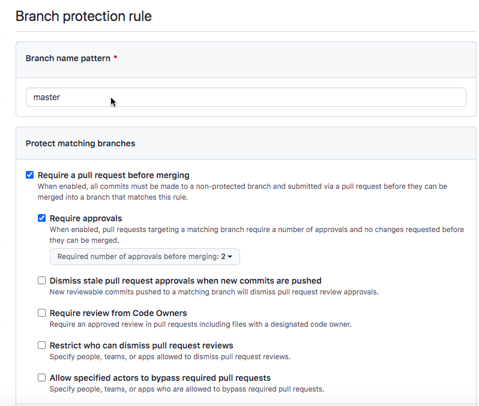


#### 4. 本地开发环境同步到远端仓库

```shell
# git仓库有3个作用域：local、global、system三个作用域
# 常用的系统账户可以设置global，将user.name和user.email与GitHub账户同步，system慎用（需要管理员权限）
git config --global user.email ${your_email_name}
git config --global user.name ${your_nick_name}

# 查看global作用域配置
git config --global --list
```

```shell
# 将git仓库备份到本地
git clone git@github.com:QingxunVectory/IntegrationMerge.git code01
cd code01/
```


##### 方法1

```shell
# 查看当前仓库的所有分支
git branch -av

# 创建一个本地同名分支 feature/cpp
git checkout -b feature/cpp

vi hello.cpp
git add hello.cpp
git commit -m 'Add hello.cpp'

# 这里会报错
git push origin
# 让本地本质与远程的同名分支建立关联，并提交commit
git push --set-upstream origin feature/cpp
```


##### 方法2

```shell
# 当前分支feature/go关联远端分支origin/feature/go；在使用push的时候直接push到远端的仓库
git checkout -b feature/go origin/feature/go

git branch -av
vi hellworld.go
git add hellworld.go
git commit -m 'Add helloworld.go'
git push
```


#### 5. GitHub Pull Request

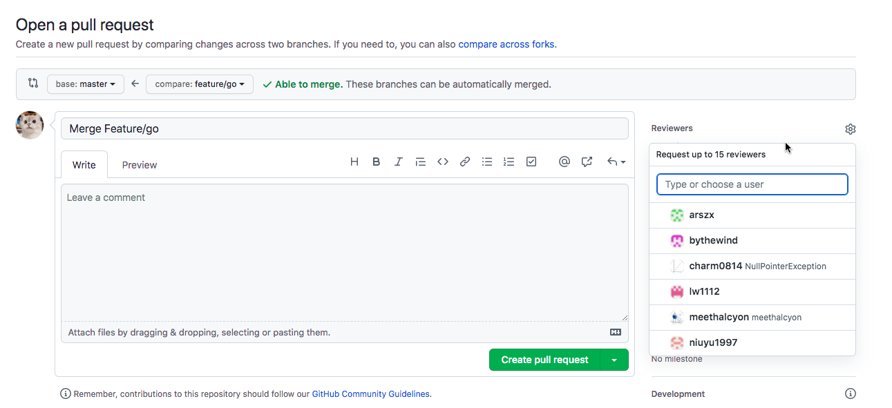


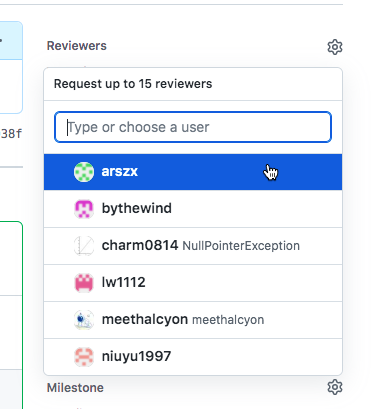

在提交的时候可以选择reviewer，进行code review，届时reviewer会收到review请求的邮件。


#### 6. GitHub Code Review

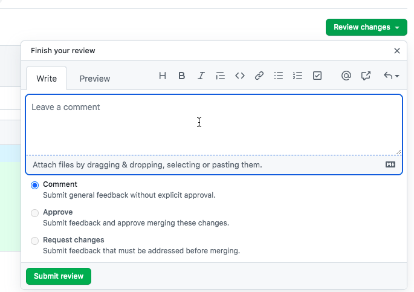

reviewer可以通过Github面板对Pull Request提出建议，Review以邮件的方式回馈给submiter。

确认合并分支后绿色的Fork标识会变成紫色。


#### 7. 多用户访问远端分支

在仓库的feature/go下做实验：

模拟用户1：

```shell
vi hellworld.go
git add hellworld.go
git commit -m'Modify helloworld.go by user1'
git push
```

模拟用户2：

```shell
git clone git@github.com:QingxunVectory/IntegrationMerge.git code02
git config --local user.email ${user2_email}
git checkout -b feature/go origin/feature/go
vi hellworld.go
git add hellworld.go
git commit -m'Modify helloworld.go by user2'
git push
```

错误提示：

```shell
To github.com:QingxunVectory/IntegrationMerge.git
 ! [rejected]        feature/go -> feature/go (fetch first)
error: failed to push some refs to 'git@github.com:QingxunVectory/IntegrationMerge.git'
hint: Updates were rejected because the remote contains work that you do
hint: not have locally. This is usually caused by another repository pushing
hint: to the same ref. You may want to first integrate the remote changes
hint: (e.g., 'git pull ...') before pushing again.
hint: See the 'Note about fast-forwards' in 'git push --help' for details.
```

出现冲突，原因是现在是非fast_forward的状态。

```shell
# 下载分支的最新版本
git fetch

# 查看所有的branch
git branch -avv
```

```shell
* feature/go                 ec9bc81 [origin/feature/go: ahead 1, behind 1] Modify helloworld.go by user2
  master                     a24ff7a [origin/master] Initial commit
  remotes/origin/HEAD        -> origin/master
  remotes/origin/feature/cpp 5d8ea5b Add hello.cpp
  remotes/origin/feature/go  79a6974 Modify helloworld.go by user1
  remotes/origin/master      a24ff7a Initial commit
```

ahead 1表示本地有一个commit没有提交到远端分支，behind 1表示远端分支有一个commit没有merge到本地。

解决方法：

```shell
# 相当于git fetch + git merge
git pull
```

```shell
Auto-merging hellworld.go
CONFLICT (content): Merge conflict in hellworld.go
Automatic merge failed; fix conflicts and then commit the result.
```

git pull失败，原因是我们修改的是同一行代码。

```shell
# 修订最终版本
vi hellworld.go

# 这里要注意分支的状态
git status
```

```shell
On branch feature/go
Your branch and 'origin/feature/go' have diverged,
and have 1 and 1 different commits each, respectively.
  (use "git pull" to merge the remote branch into yours)

You have unmerged paths.
  (fix conflicts and run "git commit")
  (use "git merge --abort" to abort the merge)

Unmerged paths:
  (use "git add <file>..." to mark resolution)
	both modified:   hellworld.go

no changes added to commit (use "git add" and/or "git commit -a")
```

```shell
# 我们要通过git add的方式去提交merge后的commit
git commit -am 'Merge hellworld.go'
git push
```

建议在每次开发之前要更新当前特性分支

```shell
git fetch/pull
```


#### 8. 用issue跟踪需求和BUG

在**Settings**的**Features**设置issue的模板。

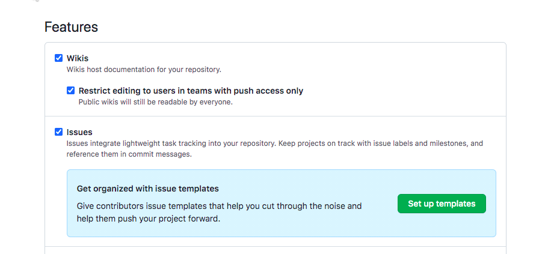

在项目issue中提交，可以将issue指派给某个人，可以设置issue的标签。在issue栏目中可以对既有的issue进行过滤筛选。


#### 9. 用projects管理issue即跟踪进度

在Projects新建Project（一个仓库可以添加多个project），有几个模板可供选择。创建好Project之后，可以通过Add Card的方式添加需要对应的任务，把它们添加到to do list里面，进而对issue、pull request以及其他任务进行跟踪管理。

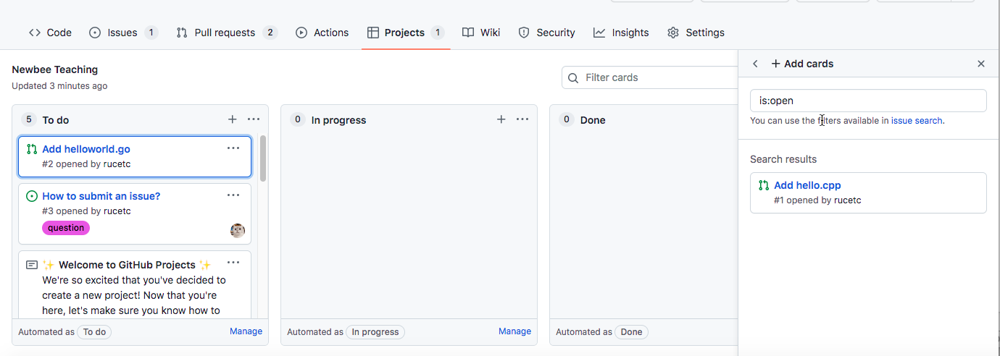


#### 10. 特性分支向master分支合并

在进行特性分支向master分支合并，有3个选项：

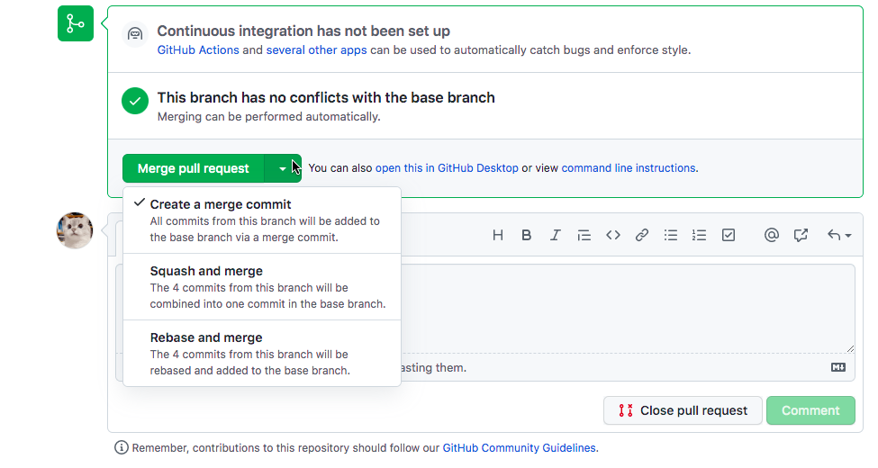

##### merge commit

将多次commit作为一个整体merge到master分支中去，相当于只处理一次冲突。

我们用merge commit的方式将feature/go分支merge到master分支，查看一下分支的状况：

```shell
git fetch
git log --graph origin/master
```

```shell
*   commit 66acfb8d4abdb2b179d558437f6c9e36776f253b (origin/master, origin/HEAD)
|\  Merge: a24ff7a 97ef0f2
| | Author: etc <72735722+rucetc@users.noreply.github.com>
| | Date:   Tue Jun 7 01:19:31 2022 +0800
| |
| |     Merge pull request #2 from QingxunVectory/feature/go
| |
| |     Add helloworld.go
| |
| *   commit 97ef0f26b19f96d7a747f98c657a2dcfa2506dd9 (HEAD -> feature/go, origin/feature/go)
| |\  Merge: ec9bc81 79a6974
| | | Author: rucetc <xzang2014@163.com>
| | | Date:   Tue Jun 7 00:23:06 2022 +0800
| | |
| | |     Merge hellworld.go
| | |
| | * commit 79a697436444406e3f4537ea59de87d74d5da5dd
| | | Author: rucetc <11840928@qq.com>
| | | Date:   Mon Jun 6 23:53:21 2022 +0800
| | |
| | |     Modify helloworld.go by user1
| | |
| * | commit ec9bc8198b6ab7c6271868ed24359e01f2cb0de4
| |/  Author: rucetc <xzang2014@163.com>
| |   Date:   Mon Jun 6 23:53:50 2022 +0800
| |
| |       Modify helloworld.go by user2
| |
| * commit 5a6379848e90951c10c3801fbc994ff61b38e56d
|/  Author: rucetc <11840928@qq.com>
|   Date:   Mon Jun 6 21:54:46 2022 +0800
|
|       Add helloworld.go
|
* commit a24ff7a0be44bbb9d29799d8ec370ba5e5c26942 (master)
  Author: etc <72735722+rucetc@users.noreply.github.com>
  Date:   Mon Jun 6 18:12:55 2022 +0800

      Initial commit
```

GitHub提供可视化的分支查看**Insights**下的**Network**


同理，我们将特性分支feature/cpp也merge进master当中，在看一下分支的状况：

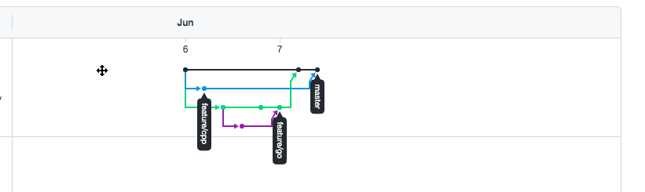

如果projects应用的模板是自动管理kanban，当我们完成将特性分支merge到master分支后，projects对应的pull request会自动切换成Done的状态。


##### squash and merge

在master分支上新生成commit，这个commit包含了特性分支里多个commit涉及的文件变更。特点是在进行merge的时候并不会影响特性分支。


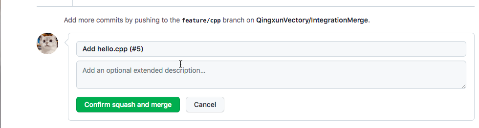

我们查看一下分支情况：

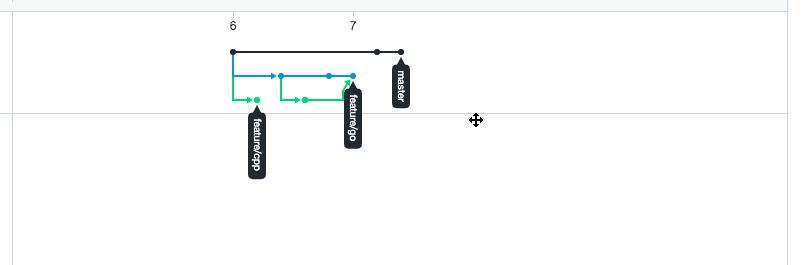


##### rebase and merge

通过rebase的方式进行合并，即对master分支进行变基，将特性分支的commit”复制“到master分支上。


在合并feature/go的时候出现冲突了。

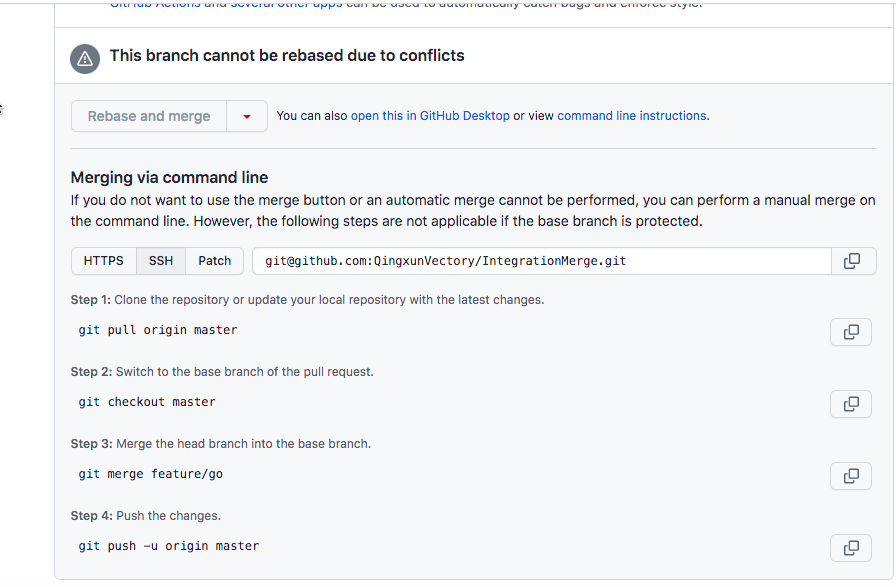


###### 第一种解决方案

根据提示信息使用命令行解决冲突。解决冲突之后Merge图标的颜色由绿色变成紫色。

查看一下合并后的分支状况：


###### 第二种解决方案

在本地恢复环境，切换到feature/go分支

```shell
# 在远端master分支上做rebase处理，也就是在远端master上
git rebase origin/master
```

会提示我们出现冲突：

```shell
First, rewinding head to replay your work on top of it...
Applying: Add helloworld.go
Applying: Modify helloworld.go by user2
Applying: Modify helloworld.go by user1
Using index info to reconstruct a base tree...
M	hellworld.go
Falling back to patching base and 3-way merge...
Auto-merging hellworld.go
CONFLICT (content): Merge conflict in hellworld.go
error: Failed to merge in the changes.
Patch failed at 0003 Modify helloworld.go by user1
hint: Use 'git am --show-current-patch' to see the failed patch
Resolve all conflicts manually, mark them as resolved with
"git add/rm <conflicted_files>", then run "git rebase --continue".
You can instead skip this commit: run "git rebase --skip".
To abort and get back to the state before "git rebase", run "git rebase --abort".
```

按照提示解决：

```shell
# 修改冲突文件
vi hellworld.go

# 将修改后的冲突文件重新加回暂存区
git add hellworld.go
git rebase --continue

# 查看分支变化
# 远端的feature/go分支通过变基的方式进行了merge。
git branch -avv

# push到远端的feature/go分支
git push origin feature/go
```

```shell
* feature/go                 dde383b [origin/feature/go: ahead 3, behind 4] Modify helloworld.go by user1
  master                     a24ff7a [origin/master] Initial commit
  remotes/origin/HEAD        -> origin/master
  remotes/origin/feature/cpp 5d8ea5b Add hello.cpp
  remotes/origin/feature/go  97ef0f2 Merge hellworld.go
  remotes/origin/master      a24ff7a Initial commit
```

查看一下feature/go的变化：

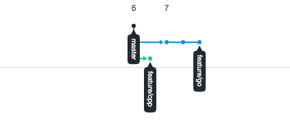

对feature/go变完基之后，可以使用rebase and merge的方式合并到master分支去了。

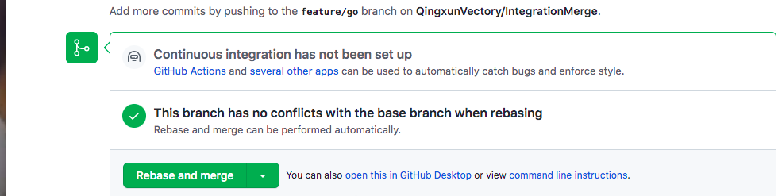

再将feature/cpp合并到master分支之后，再看一下分支的情况：

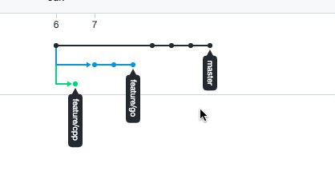

两个特性分支已经通过变基的方式合并到master分支上了。

