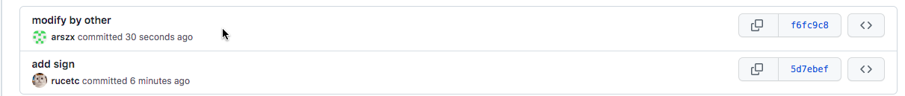
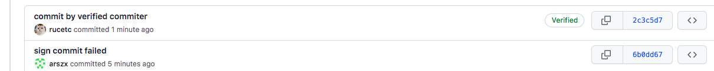
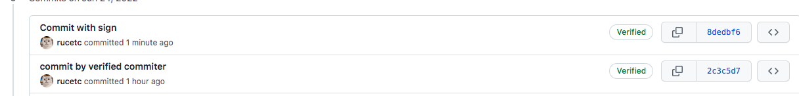

#### Github传输协议概述

Git是我们熟悉的分布式代码管理工具，既然作为一种分布式存储系统，我们需要保证它的数据一致性、可用性和容错性。这样一个避不开的问题就是我们采用何种传输协议对本地仓库和远端仓库进行同步。Git常用的传输协议包括本地协议（哑模式/智能模式）、http/https协议以及ssh协议。

Github作为一款基于Git的第三方代码托管平台，支持的传输协议有ssh和https。不使用ssl的http协议信息明文传输，https相当于http+ssl，通过ssl认证提升传输安全性。之前Github采用https进行数据传输的方法是：使用用户名和密码对repo可执行操作鉴权；通过ssl对传输数据进行加密。因此Github client可以将账户和密码明文保存在配置文件中。现在这种鉴权方式被废弃，取而代之的是personal access token的方式。这里，我推荐使用ssh协议，支持可靠的数据传输以及数据压缩。

ssh协议采用公私钥机制，这是一种非对称加密方案，与MD5等对称加密不同。对称加密在加密与解密时密钥是一致的。非对称加密策略：私钥保存在本地，将公钥复制到服务器端。当我们做git push操作时，本地私钥加密，服务端公钥解密，并且服务端可以鉴定出上传数据方是受信任的；当我们做git fetch/merge的时候，服务端用公钥加密，本地私钥解密读取数据。

注意：这里传输涉及对象是本地系统用户和Github服务器，服务器验证的对象也是本地系统用户，而非git仓库配置项中的user，关于这一点后面还有讨论。


####  使用ssh协议同步Github远端仓库

```shell
# 检查是否存在ssh公私钥
ls ~/.ssh
# 生成ssh公私钥
ssh-keygen -t ed25519 -C ${your_email_name}
# 根据提示及自身需求配置
```

```shell
ls ~/.ssh
# id_ed25519.pub是生成的公钥，将生成的秘钥粘贴到github代码托管服务器上
# id_ed25519是私钥。私钥可以留在本地。
id_ed25519  id_ed25519.pub
```

GitHub->setting->SSH and GPG keys->New SSH key添加上面的公钥即可。一个账户可以配置多个这样的公钥。

上述流程与我们配置ssh免密登录是一样的。


#### 冒充他人的提交

```shell
# 配置global作用域下的用户名和邮箱
git config --global user.name rucetc
git config --global user.email 11840928@qq.com
```


##### 自己在公共仓库commit

```shell
# 拉取远端仓库及所有分支
git clone git@github.com:QingxunVectory/IntegrationMerge.git etc

cd etc
# 切到远端同名分支fake_commiter
git checkout -b fake_commiter origin/fake_commiter
# 新建一个文件
vi sign
git add .
git commit -m "add sign"
# 同步到远端
git push

cd ..
```

##### 伪装别人在公共仓库commit

```shell
git clone git@github.com:QingxunVectory/IntegrationMerge.git fake

cd fake

# 修改local作用域下（本仓库）的user.email项
git config --local user.email xzang2014@163.com

# 切到远端同名分支fake_commiter
git checkout -b fake_commiter origin/fake_commiter
# 新建一个文件
vi sign
git add .
git commit -m "modify by other"

# 同步到远端
git push
```



猜测：当用户执行git commit的时候，会根据.git/config配置文件中的user项配置commit对象中author信息。当执行git push向远端仓库同步变更（commit）的时候，Github仅会根据commit中邮箱的信息映射Github账户，并不会对提交账户身份进行验证。


#### Github设置签名提交

类似于使用ssh协议，Github通过公私钥机制对客户端发送信息的身份进行验证，这里需要用到gpg工具，通过校验的commiter在commit list的信息中会有Verified标志。

##### 生成GPG密钥对

```shell
# 具体配置流程：选择RSA加密方式；密钥长度至少4096位；过期时间随意（默认永久）；邮箱设置为Github关联账户邮箱；设置口令
gpg --full-generate-key

# 以长格式查看密钥对
gpg --list-secret-keys --keyid-format=long
```

```shell
# 19AE0BB8364E81C1是GPG密钥ID
sec   rsa4096/19AE0BB8364E81C1 2022-06-24 [SC]
      EFE1CFAC2744EE87AFB159AF19AE0BB8364E81C1
uid                 [ultimate] rucetc <11840928@qq.com>
ssb   rsa4096/1342A24FD149FF32 2022-06-24 [E]
```

```shell
# 复制密钥，从-----BEGIN PGP PUBLIC KEY BLOCK-----开始，到-----END PGP PUBLIC KEY BLOCK-----结束
gpg --armor --export 19AE0BB8364E81C1
--delete-secret-keys
```

粘贴到Github->Setting->SSH and GPG keys->New GPG key中。


##### 对commit签名

```shell
# -S：对commit签名
git commit -S
```

###### 伪装者提交

```shell
vi sign
git add .
# 使用伪装者签名会报错
git commit -S
```

```shell
# 错误信息：使用GPG签名认证失败，无法使用签名提交
error: gpg failed to sign the data
fatal: failed to write commit object
```

###### 认证用户提交

```shell
git pull
vi sign
git add .
git commit -S
git push
```




##### 默认使用签名commit

```shell
# global作用域内所有的仓库提交时默认使用签名
git config --global commit.gpgsign true
```

```shell
vi sign
git add .
# 这里没有设置-S
git commit -m "Commit with sign"
git push
```




#### 使用Github Desktop设置签名提交

我使用的是Github Desktop Mac版。其实桌面版与非桌面版Github客户端在设置上完全一致，需要注意的是Mac系统默认没有安装GPG工具。安装GPG工具有两种方式：

- brew安装

  ```shell
  brew install gpg
  ```

- 安装包安装

  地址：https://sourceforge.net/p/gpgosx/docu/Download/。推荐使用安装包安装。

在我使用安装包安装完毕后GPG的版本是2+，不妨查看一下版本号：

```shell
# 注意可执行程序是gpg2
gpg2 --version
```

生成密钥对、在Github添加GPG公钥的方法不再赘述。注意，需要设置一下Git作用域的GPG启动程序，这里用的是GPG2。

```shell
git config --global gpg.program gpg2
```

再使用Github Desktop提交时就能看到认证标识了。


#### 管理多GPG密钥对

##### 替换GPG密钥对

当我们有多个GPG密钥用于不同用户身份认证时（不推荐这样做），可以采用下述方式切换用于Github认证的GPG密钥：

```shell
git config --${global/local} user.signingkey ${secret_key_id}
```

